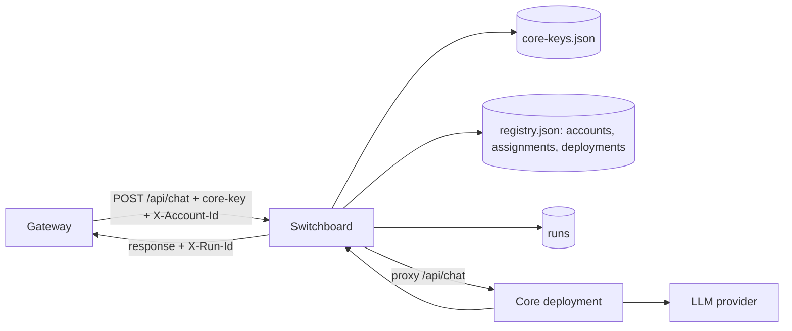
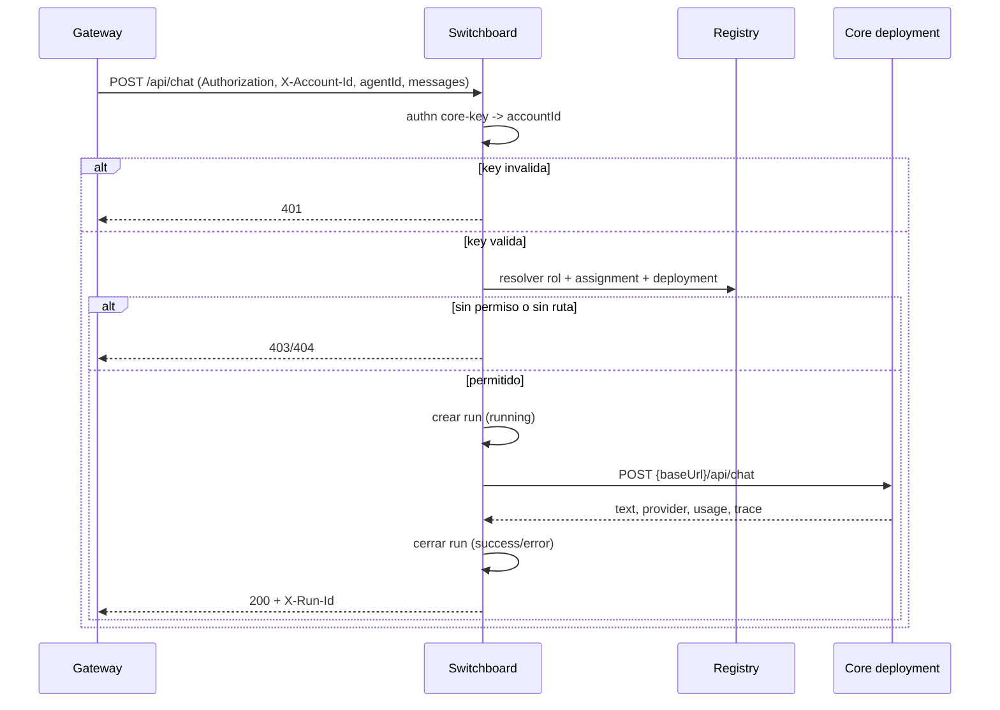
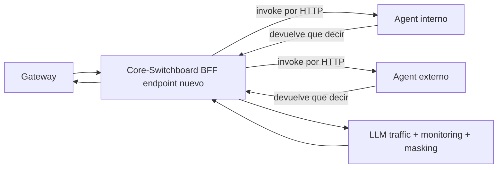

# Architecture

## Objetivo

Definir una vista unica y canonica de la arquitectura `core + switchboard`, alineada con:

- contrato de integracion `switchboard <-> core` v1,
- RBAC v2 multi-tenant por `accountId`,
- estado operativo registrado en `avance.md`.

Este documento reemplaza y consolida la documentacion previa separada de:

- arquitectura core/gateway,
- contrato switchboard/core v1,
- matriz RBAC v1.

## Sistema y limites

- `core` (data plane): ejecuta agentes y expone `/health`, `/api/chat`, `/api/config`.
- `switchboard` (control plane): autentica, autoriza, enruta por tenant y registra runs.
- `gateway` (cliente externo): UI + gestion de sus tenants; consume `switchboard`.

`switchboard` vive dentro del repo de `core`, pero se trata como plano de control separado del plano de ejecucion.

### Diagrama de componentes (estado actual)



## Contrato operativo actual (v1)

### Flujo base de chat

1. `gateway` llama `POST /api/chat` en `switchboard`.
2. `switchboard` autentica por `core-key` y resuelve `accountId`.
3. `switchboard` aplica RBAC por rol de `registry.accounts`.
4. `switchboard` resuelve `accountId + agentId -> deployment.baseUrl`.
5. `switchboard` crea `run` (`running`) y hace proxy a `{baseUrl}/api/chat`.
6. `core` responde payload de chat (`text`, `provider`, `usage`, `trace`).
7. `switchboard` cierra `run` (`success`/`error`) y devuelve `X-Run-Id`.

### Responsabilidades por componente

- `switchboard`
  - Resuelve `accountId + agentId -> deployment`.
  - Reenvia request a `deployment.baseUrl + /api/chat`.
  - Registra trazabilidad (`runId`, estado, latencia, errores).
- `core`
  - Expone `/health`, `/api/chat`, `/api/config`.
  - Ejecuta logica de agente y devuelve payload de chat.
  - No gestiona tenants ni assignments del gateway.

### Payload minimo reenviado a core

```json
{
  "agentId": "consultor-ia",
  "messages": [
    { "role": "user", "parts": [{ "text": "Hola" }] }
  ],
  "appendSystemPrompt": "opcional",
  "preferredProvider": "openai"
}
```

### Payload esperado de exito desde core

```json
{
  "text": "respuesta",
  "provider": "openai",
  "usage": {
    "inputTokens": 100,
    "outputTokens": 50
  },
  "trace": {
    "runId": "core-xxxx",
    "fingerprint": "fp-xxxx"
  }
}
```

### Secuencia `POST /api/chat` (v1)



### Errores y trazabilidad

- Error de routing/infra: `4xx/5xx` con `error`, `detail`, `runId`.
- Error downstream core: `502` con `error`, `detail`, `runId`.
- Correlacion minima: header `X-Run-Id` + consulta en `GET /api/runs/:runId`.

## Seguridad y tenancy (RBAC v2)

- Separacion explicita authn/authz:
  - authn: `core-key` valida acceso de cuenta.
  - authz: rol se resuelve en `registry.accounts`.
- Roles activos:
  - `admin-tecnico`: acceso total.
  - `operador-cuenta`: lectura + chat en su `accountId`.
  - `lector-cuenta`: solo lectura en su `accountId` (sin chat).
- Naming canonico: `accountId`.
- Compat legacy eliminada: `clientId` (header/body/query) responde `400`.

### Matriz RBAC por endpoint

| Endpoint | admin-tecnico | operador-cuenta | lector-cuenta |
|---|---|---|---|
| `GET /health`, `GET /`, `GET /control` | Allow | Allow | Allow |
| `GET /api/runs` | Allow (all accounts) | Allow (solo su `accountId`) | Allow (solo su `accountId`) |
| `GET /api/runs/:runId` | Allow | Allow (si el run es de su `accountId`) | Allow (si el run es de su `accountId`) |
| `POST /api/chat` | Allow | Allow (si `accountId` coincide) | Deny |
| `GET /api/registry/accounts` | Allow (all) | Allow (solo su cuenta) | Allow (solo su cuenta) |
| `GET /api/registry/accounts/:id` | Allow | Allow (solo su cuenta) | Allow (solo su cuenta) |
| `POST/PATCH/DELETE /api/registry/*` | Allow | Deny | Deny |
| `GET /api/status` | Allow | Deny | Deny |
| `GET /api/registry/status` | Allow | Deny | Deny |

### Configuracion de core-keys

- `SWITCHBOARD_RBAC_ENABLED=true`
- `SWITCHBOARD_CORE_KEYS=<json-array>`
- o archivo JSON en `SWITCHBOARD_KEYS_PATH` (default `switchboard/data/core-keys.json`)

Formato:

```json
[
  { "id": "key-platform-01", "label": "Platform Admin", "key": "adm", "accountId": "platform", "status": "active" },
  { "id": "key-inspiro-01", "label": "Inspiro Gateway", "key": "op1", "accountId": "inspiro-comercial", "status": "active" }
]
```

## Persistencia y despliegue

- Registro primario actual: archivo local (`switchboard/data/registry.json`).
- Persistencia DB (Neon/Postgres) implementada pero postergada para fase activa.
- Cuando se usa DB, el schema canonico de runtime es `accounts/account_id` (no `clients/client_id`).
- Validacion E2E ya ejecutada en local: `switchboard -> core` con runs `success/error`.
- Baseline de despliegue: Docker/K8s local validado para `core`.

## Seguridad minima de integracion

- `switchboard` autentica al gateway por `core-key` y resuelve `accountId`.
- El rol efectivo se obtiene desde `registry.accounts` (RBAC v2).
- `core` puede protegerse con API key/deploy token.
- Recomendado: TLS y secretos fuera de repositorio.

## Direccion de autenticacion para gateway frontend-only

Contexto de producto:

- `gateway` sera frontend puro para administracion de cuenta/tenants/agentes.
- En frontend no se deben exponer secretos de servicio (`core-key`).

Dirección objetivo:

- Authn principal por JWT de usuario (OIDC/OAuth2 PKCE).
- `switchboard` valida `issuer/audience/jwks` y aplica RBAC por claims (`roles`, `allowedAccounts`).
- `core-key` se mantiene para integraciones M2M (no UI).

Referencia de plan: `docs/playbook/frontend-gateway-jwt-access-plan.md` (Fase 0-4).

## Smoke test minimo

1. `GET {core}/health` devuelve `200` y `ok=true`.
2. `POST {switchboard}/api/chat` con `X-Account-Id` valido devuelve `X-Run-Id`.
3. `GET {switchboard}/api/runs/{runId}` devuelve `success` o `error`.

## Direccion de evolucion (backlog activo)

Feature `F-202603-06-core-bff-agent-proxy` define la siguiente iteracion:

- Nuevo endpoint de BFF que sustituye `POST /api/chat` (migracion controlada).
- Agentes internos y externos se invocan por HTTP (mismo contrato).
- Los agentes devuelven "que decir"; el BFF centraliza envio/LLM/monitoring/masking.
- Se mantiene trazabilidad de runs y controles RBAC en el nuevo flujo.

### Esquema objetivo (F-202603-06)



## Referencias canonicas

- `docs/playbook/avance.md`
- `docs/playbook/state.md`
- `docs/playbook/core-contract-v1.md`
- `docs/playbook/gateway-bff-integration-v2.md`
- `docs/playbook/frontend-gateway-jwt-access-plan.md`
- `docs/playbook/core-keys-rotation-runbook.md`
- `docs/playbook/features/F-202603-06-core-bff-agent-proxy.md`
