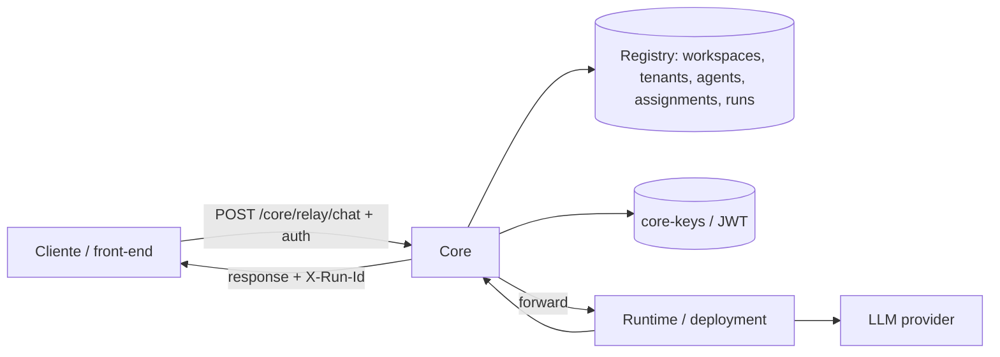
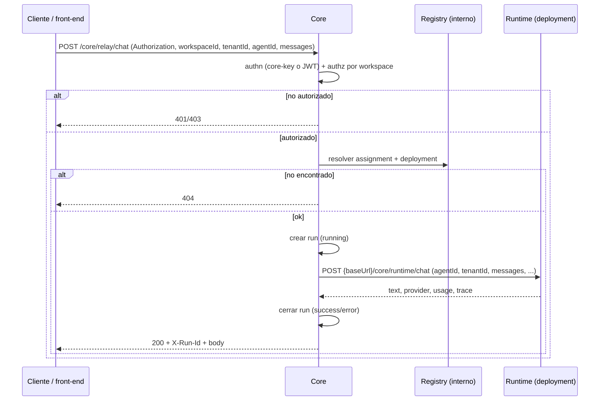
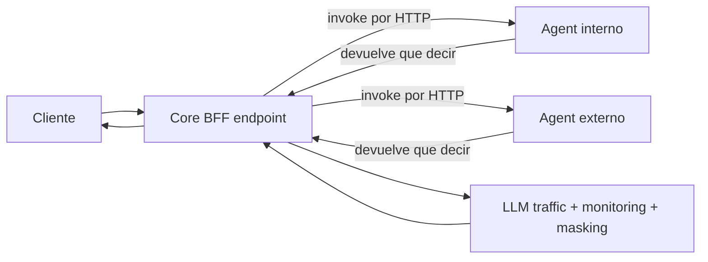

# Architecture

## Objetivo

Definir una vista unica y canonica de la arquitectura `core + switchboard`, alineada con:

- contrato de integracion `switchboard <-> core` v1,
- RBAC v2 multi-tenant por workspace (`workspaceId` / `allowedWorkspaces`),
- estado operativo registrado en `avance.md`.

Este documento reemplaza y consolida la documentacion previa separada de:

- arquitectura core/gateway,
- contrato switchboard/core v1,
- matriz RBAC v1.

## Sistema y limites

- **`core`**: unica superficie publica. Expone `core/*` (health, me, workspaces, tenants, agents, runs, **POST /core/relay/chat**). Integra internamente el modulo switchboard (registro, RBAC) y el runtime de agentes.
- **`switchboard`**: modulo **interno** (control plane). Registro (workspaces, tenants, agents, deployments, assignments, runs), RBAC por workspace, resolucion tenant+agent→deployment. No se expone como API publica separada.
- **Cliente / hipotético front-end**: Cualquier aplicacion (p. ej. SPA) que consuma la API publica de **core** (`POST /core/relay/chat`, `GET /core/runs`, etc.) con core-key (M2M) o JWT de usuario. No hay producto «gateway» en el repo; se habla de un consumidor hipotetico.

Contrato publico canonico: `docs/core-contract-v1.md`.

### Diagrama de componentes (estado actual)



## Contrato operativo actual (v1)

### Flujo canonico de chat (API publica)

1. Cliente (p. ej. un hipotético front-end) llama **`POST /core/relay/chat`** en **core** con auth (core-key o JWT) y body `workspaceId`, `tenantId`, `agentId`, `messages`.
2. Core autentica y autoriza (RBAC por workspace).
3. Core usa el registro (switchboard interno) para resolver `tenantId + agentId -> deployment`.
4. Core crea `run` (`running`) y reenvia a `deployment.baseUrl` (runtime).
5. Runtime ejecuta agente y LLM; responde a core.
6. Core cierra `run` (`success`/`error`) y devuelve respuesta con `X-Run-Id`.

### Responsabilidades por componente

- **core**
  - Expone API publica `core/*` (health, me, workspaces, tenants, agents, runs, **POST /core/relay/chat**).
  - Usa switchboard (interno) para registro y RBAC.
  - Orquesta runs y reenvio al runtime (deployment).
- **switchboard** (interno)
  - Registro: workspaces, tenants, agents, deployments, assignments, runs.
  - RBAC por workspace; resolucion tenant+agent→deployment.
  - No expone endpoints publicos; core invoca su logica internamente.

### Payload minimo de `POST /core/relay/chat`

```json
{
  "workspaceId": "inspiro-agents",
  "tenantId": "aliantza",
  "agentId": "aliantza-compras",
  "messages": [
    { "role": "user", "parts": [{ "text": "Hola" }] }
  ],
  "metadata": {}
}
```

### Payload esperado de exito desde core

```json
{
  "text": "respuesta",
  "provider": "openai",
  "usage": {
    "inputTokens": 100,
    "outputTokens": 50
  },
  "trace": {
    "runId": "core-xxxx",
    "fingerprint": "fp-xxxx"
  }
}
```

### Secuencia `POST /core/relay/chat` (v1)



### Errores y trazabilidad

- Error de routing/infra: `4xx/5xx` con `error`, `detail`, `runId`.
- Error downstream runtime: `502` con `error`, `detail`, `runId`.
- Correlacion minima: header `X-Run-Id` + consulta en `GET /core/runs/:runId`.

## Seguridad y tenancy (RBAC v2)

- Separacion explicita authn/authz:
  - authn: `core-key` (M2M) o JWT de usuario.
  - authz: rol y `allowedWorkspaces` desde registro o claims JWT.
- Roles activos:
  - `admin-tecnico`: acceso total.
  - `operador-cuenta`: lectura + chat en sus workspaces.
  - `lector-cuenta`: solo lectura en sus workspaces (sin chat).
- Naming canonico: `workspaceId`, `tenantId` en API publica.

### Matriz RBAC por endpoint (API publica `core/*`)

| Endpoint | admin-tecnico | operador-cuenta | lector-cuenta |
|---|---|---|---|
| `GET /core/health` | Allow | Allow | Allow |
| `GET /core/me` | Allow | Allow | Allow |
| `GET /core/workspaces` | Allow (all) | Allow (solo sus workspaces) | Allow (solo sus workspaces) |
| `GET /core/workspaces/:id/tenants` | Allow | Allow (scope workspace) | Allow (scope workspace) |
| `GET /core/tenants/:id/agents` | Allow | Allow (scope tenant) | Allow (scope tenant) |
| `GET /core/runs` | Allow (all) | Allow (scope workspace) | Allow (scope workspace) |
| `GET /core/runs/:runId` | Allow | Allow (si run en su scope) | Allow (si run en su scope) |
| `POST /core/relay/chat` | Allow | Allow (scope workspace/tenant) | Deny |

### Configuracion de core-keys

- `SWITCHBOARD_RBAC_ENABLED=true`
- `SWITCHBOARD_CORE_KEYS=<json-array>`
- o archivo JSON en `SWITCHBOARD_KEYS_PATH` (default: path relativo al modulo switchboard, p. ej. `src/switchboard/data/core-keys.json`)

Formato:

```json
[
  { "id": "key-platform-01", "label": "Platform Admin", "key": "adm", "accountId": "platform", "status": "active" },
  { "id": "key-client-01", "label": "Cliente M2M", "key": "op1", "accountId": "inspiro-comercial", "status": "active" }
]
```

## Persistencia y despliegue

- Registro: DB Neon/Postgres con esquema completo (workspaces, users, workspace_memberships, tenants, agents, deployments, assignments, runs). Fallback a archivo `registry.json` si no hay DB.
- Validacion E2E: core con `POST /core/relay/chat`, runs y dominio en DB o fallback.
- Baseline de despliegue: Docker/K8s local validado para core.

## Seguridad minima de integracion

- **core** autentica al cliente (front-end con JWT o integracion M2M con core-key) y aplica RBAC por workspace (usando el registro/switchboard interno).
- El rol y `allowedWorkspaces` se resuelven desde el registro o los claims JWT.
- Recomendado: TLS y secretos fuera de repositorio.

## Direccion de autenticacion para un hipotético front-end

Contexto:

- Un hipotético front-end (p. ej. SPA) podria administrar cuenta/tenants/agentes consumiendo `core/*`.
- En el front-end no se deben exponer secretos de servicio (`core-key`); usar JWT de usuario.

Dirección objetivo:

- Authn principal por JWT de usuario (OIDC/OAuth2 PKCE).
- `switchboard` valida `issuer/audience/jwks` y aplica RBAC por claims (`roles`, `allowedWorkspaces`).
- `core-key` se mantiene para integraciones M2M (no UI).

Referencia de plan: `docs/frontend-jwt-access-plan.md` (Fase 0-4; redactado para un hipotético front-end).

## Smoke test minimo

1. `GET /core/health` devuelve `200` y `ok=true`.
2. `POST /core/relay/chat` con auth (core-key o JWT) y body valido (workspaceId, tenantId, agentId, messages) devuelve respuesta con `X-Run-Id`.
3. `GET /core/runs/{runId}` devuelve el run (`success` o `error`).

## Direccion de evolucion (backlog activo)

Feature `F-202603-06-core-bff-agent-proxy` define la siguiente iteracion:

- Evolucion del BFF: endpoint que centraliza proxy a agentes + LLM + monitoreo/masking (complementando o sustituyendo flujos actuales).
- Agentes internos y externos se invocan por HTTP (mismo contrato).
- Los agentes devuelven "que decir"; el BFF centraliza envio/LLM/monitoring/masking.
- Se mantiene trazabilidad de runs y controles RBAC en el nuevo flujo.

### Esquema objetivo (F-202603-06)



## Referencias canonicas

- `docs/playbook/avance.md`
- `docs/playbook/state.md`
- `docs/core-contract-v1.md`
- `docs/bff-integration-v2.md`
- `docs/frontend-jwt-access-plan.md`
- `docs/core-keys-rotation-runbook.md`
- `docs/playbook/features/F-202603-06-core-bff-agent-proxy.md`
