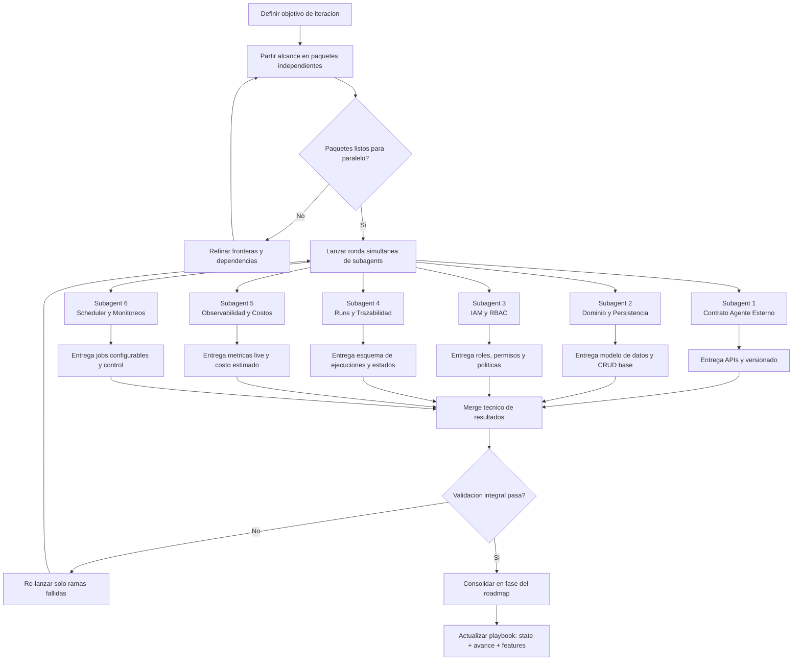

# Roadmap

Documento vivo para capturar lo que falta para cumplir la vision del proyecto.

## Vision

> Version inicial para alinear negocio, operacion y arquitectura.

### Declaracion de vision (v0.1)

- `core` evoluciona hacia un backend de control (`Gateway`) para operar cuentas/clientes y sus agentes de IA en produccion.
- Cada agente se ejecuta como servicio independiente (data plane) y puede seguir operando aunque el Gateway no este disponible.
- El Gateway centraliza configuracion, monitoreo, trazabilidad de ejecuciones, permisos y control economico por cuenta/agente.
- El modelo debe soportar desde automatizaciones internas simples hasta agentes externos especializados (ej. `aliantza-compras`).

### Principios de la vision

- Separacion clara entre control plane (gestion) y data plane (ejecucion de agentes).
- Multi-tenant por defecto (cuentas aisladas en permisos, datos y costos).
- Configuracion por capas con precedencia explicita: `core` -> `cuenta` -> `cuenta-agente`.
- Observabilidad primero: cada llamada relevante debe quedar trazable por `runId/callId`.
- Operacion cloud-native: despliegue y escalado en Kubernetes con contratos API consistentes.

### Senales de que la vision se cumple

- Un cliente puede entrar al Gateway, ver sus agentes, revisar ejecuciones y costos sin acceso a datos de otros clientes.
- Un usuario tecnico puede gestionar cuentas, agentes, despliegues y permisos desde un solo panel/API.
- La caida del Gateway no interrumpe llamadas directas a los agentes desplegados.
- Existe trazabilidad completa por ejecucion: payload relevante, estado, tokens in/out, modelo y costo.
- El negocio tiene visibilidad financiera por cuenta/agente (costos, ingresos, pendientes).

## Matriz de gap (vision vs estado actual)

| Capacidad | Estado actual | Gap principal |
|---|---|---|
| Gestion de cuentas/clientes | Parcial (`switchboard` con registro JSON) | Persistencia robusta, aislamiento multi-tenant, auditoria |
| Agentes externos por API independiente | Parcial (routing por `baseUrl`) | Formalizar contrato estandar de agente y ciclo de vida |
| Configuracion por 3 niveles | Parcial (`core` + subcuenta-agente) | Falta capa `cuenta` y reglas de herencia/override |
| Cron jobs y monitoreos configurables | No | Scheduler, definicion de jobs, historial y controles |
| Ejecuciones por estado del agente | No | Modelo `runs/executions`, APIs de consulta y filtros |
| Ver sesion por `callId` y continuar | Parcial minimo | Persistir, consultar y reanudar conversacion server-side |
| Actividad en vivo con tokens/costo | Parcial tecnico (usage en respuesta/logs) | Streaming, almacenamiento de metricas y calculo de costo |
| Acceso de clientes con permisos | No | IAM/RBAC multi-tenant |
| Control economico del negocio | No | Modulo FinOps (costos, ingresos, CxC, adicionales) |
| Pruebas de agente y pipelines de training/eval | No | Modulo de experiments y orquestacion |

## Terminologia minima

- **Control plane**: backend de gestion (Gateway) para cuentas, agentes, permisos y operacion.
- **Data plane**: servicios de agentes que procesan requests reales.
- **Tenant**: cuenta/cliente aislado (ej. Aliantza).
- **Deployment**: instancia desplegada de un agente (URL, version, entorno).
- **Assignment**: relacion tenant + agente -> deployment.
- **Run/Execution**: una corrida puntual del agente (tu `callId`).
- **Traceability**: capacidad de seguir una ejecucion punta a punta.
- **Observability**: metricas, logs y eventos para operar y diagnosticar.
- **RBAC**: permisos por rol para usuarios tecnicos y usuarios de cuenta.

## Roadmap por fases

### Fase 0 - Alineacion de arquitectura

Objetivo: cerrar definiciones para evitar retrabajo.

Entregables:
- Contrato API de agente externo (`/health`, `/api/chat`, `/api/config`, opcional `/api/runs`).
- Modelo de dominio base: cuentas, agentes, deployments, assignments, usuarios, roles.
- Reglas de configuracion por capas y precedencia.

### Fase 1 - MVP Gateway multi-tenant

Objetivo: operar cuentas y agentes externos en produccion con trazabilidad minima.

Entregables:
- Persistencia real para dominio base (reemplazar registro JSON).
- CRUD/API para cuentas, agentes, deployments y assignments.
- Autenticacion + RBAC basico (admin tecnico, operador cuenta, lector cuenta).
- Registro de ejecuciones con `runId/callId`, estado y metadata minima.

### Fase 2 - Operacion y observabilidad avanzada

Objetivo: mejorar confiabilidad operativa y visibilidad en tiempo real.

Entregables:
- Monitor de actividad en vivo por agente/cuenta (tokens in/out, modelo, costo estimado).
- Busqueda y detalle de ejecuciones por estado/categoria de cada agente.
- Configuracion de cron jobs/monitores de input por agente.
- Alertas basicas de salud y degradacion de deployments.

### Fase 3 - Producto de negocio y optimizacion

Objetivo: convertir operacion tecnica en plataforma de negocio.

Entregables:
- Modulo economico por cuenta/agente (costos, ingresos, cuentas por cobrar, adicionales).
- Espacio de pruebas de agentes y pipelines de evaluacion/training.
- Dashboards ejecutivos y reportes exportables.
- Endurecimiento de seguridad y auditoria de cambios.

## Flujograma de ejecucion simultanea (subagents)

Este flujo propone como trabajar en paralelo para acelerar la implementacion del roadmap, sin perder coherencia tecnica.

### Mapeo recomendado de subagents por fase

- **Fase 0**: `S1`, `S2`, `S3` en paralelo, luego merge y validacion.
- **Fase 1**: `S2`, `S3`, `S4` como nucleo MVP; `S1` en soporte de contrato.
- **Fase 2**: `S4`, `S5`, `S6` en paralelo para operacion en vivo.
- **Fase 3**: `S5` + un subagent de producto/finops para monetizacion y reportes.

## Decisiones abiertas

- Definir si `switchboard` se absorbe dentro de `core` o sigue como servicio separado.
- Elegir base de datos principal para dominio Gateway y eventos de ejecucion.
- Definir estrategia de costos por modelo (tabla fija, proveedor, o mixto).
- Delimitar alcance del MVP para continuar conversacion por `callId`.
